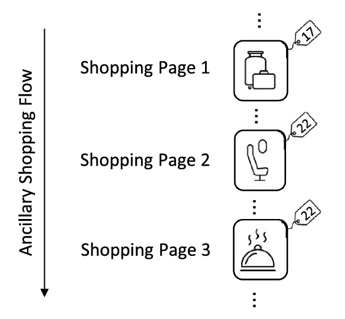
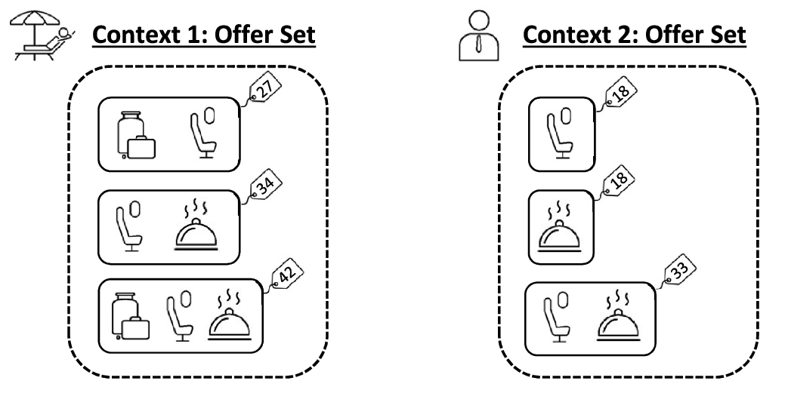

---
# You can also start simply with 'default'
theme: Seriph
# random image from a curated Unsplash collection by Anthony
# like them? see https://unsplash.com/collections/94734566/slidev
background: ./assets/cover_bg.webp
# some information about your slides (markdown enabled)
title: ارائه درس شبیه سازی
info: |
  ## Slidev Starter Template
  Presentation slides for developers.

  Learn more at [Sli.dev](https://sli.dev)
# apply unocss classes to the current slide
class: text-center
# https://sli.dev/features/drawing
drawings:
  persist: false
# slide transition: https://sli.dev/guide/animations.html#slide-transitions
transition: slide-left
# enable MDC Syntax: https://sli.dev/features/mdc
mdc: true
dir: rtl
addons:
  - slidev-addon-rabbit
  - fancy-arrow

rabbit:
  slideNum: true
---

# Markov Chains & Dynamic Pricing
## Airline Ancillary Offer Optimization

<!--
ancillary: خذمات جانبی
-->

امیر حسین دشتی و علیرضا قبادی، ۱۴۰۴/۰۱/۱۹

<carbon:arrow-right />  اسلاید بعدی 

<!--
The last comment block of each slide will be treated as slide notes. It will be visible and editable in Presenter Mode along with the slide. [Read more in the docs](https://sli.dev/guide/syntax.html#notes)
-->
---
dir: rtl
transition: fade-out
---

# موضوعات مورد بحث
کامل شود با فرمت لیست

---
layout: section
---

# تعاریف اولیه

در این بخش به ارائه اصطلاحات  مورد استفاده در ارائه خواهیم پرداخت.

---
dir: rtl
---

# تعاریف اولیه

## Offer
منظور از offer یک پیشنهاد برای خرید است که احتمالا با قیمت ارزان‌تر از قیمت مورد انتظار خواهد بود. یک پیشنهاد می‌تواند به صورت bundle(ترکیبی از چند محصول) یا تکی باشد.

---
layout: section
dir: rtl
---

# مقدمه

در این بخش شروع به توضیح مسئله و تشریح آن می‌پردازیم.

---
transition: fade-out
dir: rtl
src: ./pages/introduction.rtl.md
---

some text

---
layout: fact
dir: rtl
transition: slide-down
---

<strong>
احتمال خرید یک پیشنهاد، فقط به قیمت اون پیشنهاد وابسته نیست. بلکه به قیمت سایر پیشنهادات در سبد پیشنهادات برای مشتری نیز بستگی دارد
</strong>

<FancyArrow v-click="2" q1="[data-id=customers-rights]" pos1="bottom" q2="[data-id=customers-wrongs]" head-size="30" pos2="top" color="teal" width="4" roughness="3" arc="0.1" seed="1" />

 
 
 

مشتری 

زمانی که یک آفر دریافت می‌کنه اون رو با جایگزین‌های موجود مقایسه می‌کنه

---
layout: section
dir: rtl
---

# توضیح کسب درآمد صنعت هواپیمایی

در زمان گذشته، حال، آینده

---
dir: rtl
transition: fade
---
از سال ۲۰۰۰ به بعد، دو مدل اصلی در فروش بلیط هواپیما ظهور کرد:

## خطوط هوایی کامل (Full-Service Airlines)
  - فروش بلیط به صورت بسته‌بندی شده (باندل)
  - خدمات جنبی مانند بار مجانی، غذا و انتخاب صندلی به‌صورت پیش‌فرض در قیمت بلیط گنجانده می‌شد.
  - مدل درآمدی مبتنی بر قیمت ثابت و خدمات یکپارچه.

## خطوط هوایی کم‌هزینه (Low-Cost Carriers - LCCs)
- فروش بلیط پایه به صورت جدا از خدمات اضافی
- خدمات جانبی (اضافه‌بار، غذا، صندلی) به صورت اختیاری و با هزینه جداگانه ارائه می‌شد.
- حق انتخاب بیشتر برای مسافر و مدل درآمدی انعطاف‌پذیر.

---
dir: rtl
transition: fade
---

## همگرایی دو مدل کسب‌وکار
با گذشت زمان، هر دو گروه به سمت یکدیگر حرکت کردند:

- شرکت‌های کم‌هزینه با مشاهده موفقیت مدل باندل، شروع به ارائه پکیج‌های ترکیبی کردند تا مشتریان خطوط سنتی را جذب کنند.
- خطوط هوایی سنتی برای رقابت با شرکت‌های ارزان‌قیمت، فروش تک‌خدمات (Unbundled) را آغاز کردند تا به مسافران انعطاف بیشتری بدهند.
- امروز، مرز بین این دو مدل کمرنگ شده و بسیاری از شرکت‌ها ترکیبی از هر دو استراتژی را به کار می‌گیرند تا پاسخگوی نیازهای متنوع مسافران باشند.

---
dir: rtl
layout: two-cols
class: text-center
---

<template v-slot:default>

# توضیع فعلی محصولات

</template>
<template v-slot:right>

# ویژگی‌ها

</template>

---
dir: rtl
layout: two-cols
class: text-center
---

<template v-slot:default>

# پیشنهادات پویا

</template>
<template v-slot:right>

# ویژگی‌ها

</template>

---
layout: section
dir: rtl
---

# فرمول‌سازی مسئله

مدل‌کردن مسئله به زبان ریاضی

---
layout: section
dir: rtl
---

# چگونگی عملکرد MCCM

مزیت MCCM: احتمال خرید باندل‌های غیر سودآور را ضعیف کرده و مشتریان را به خرید پیشنهادات سودآور هدایت می‌کند.

---
transition: fade
---

<h1 dir="rtl">
منابع
</h1>

- Dynamic offer creation for airline ancillaries using a Markov chain choice model, Kevin K. Wang, 2023

---
layout: end
---
با تشکر از همراهی شما
