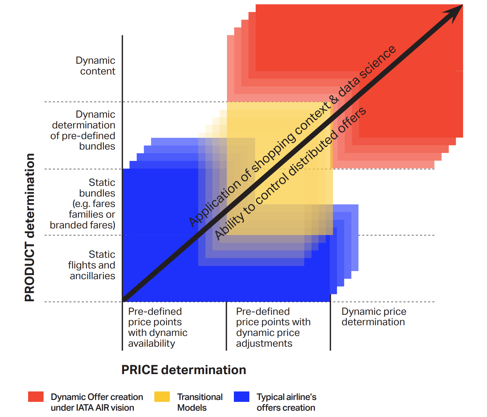
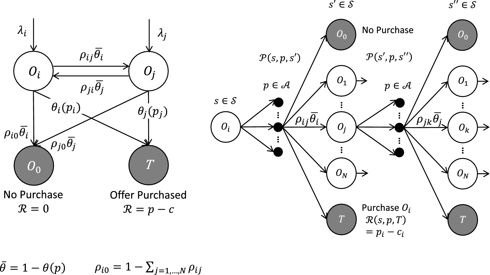
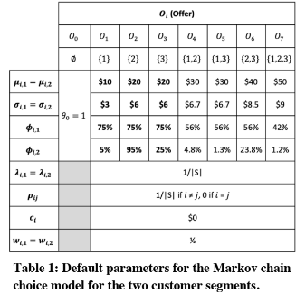
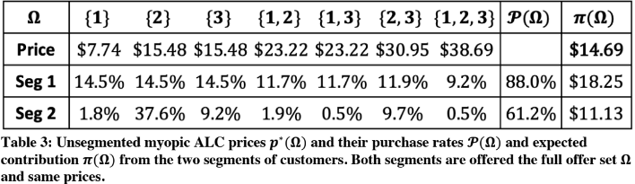
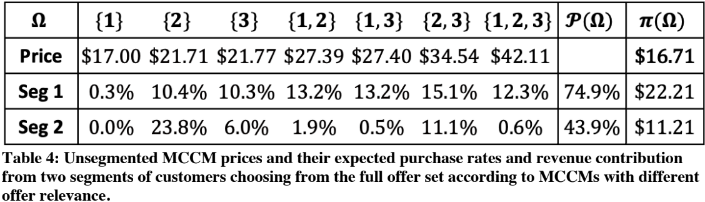
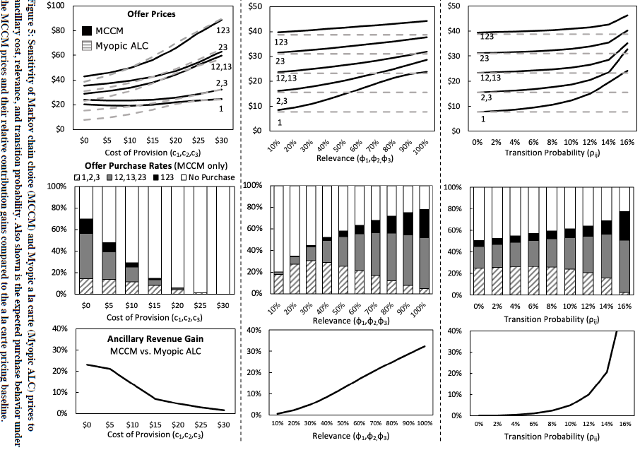
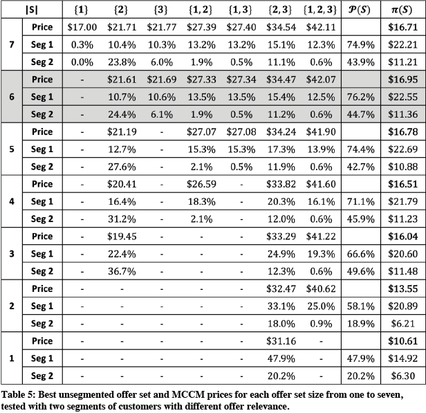
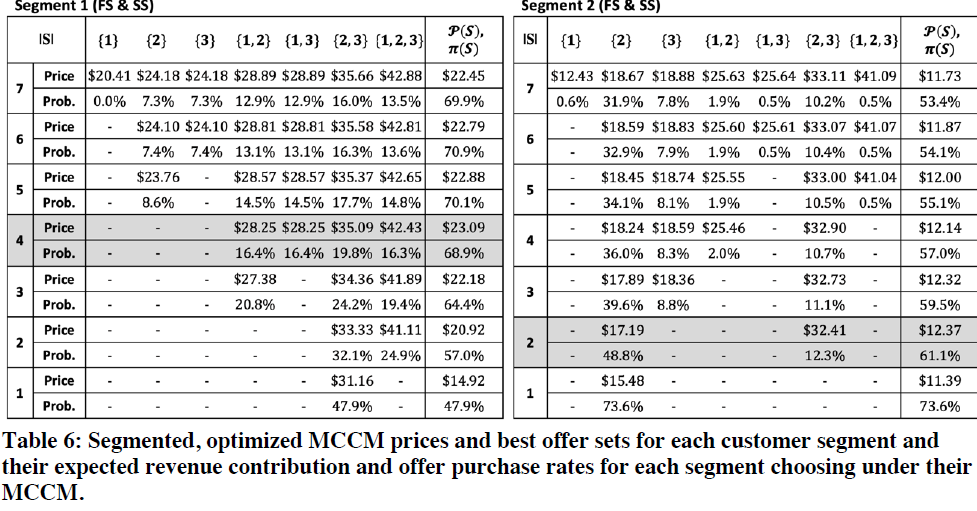
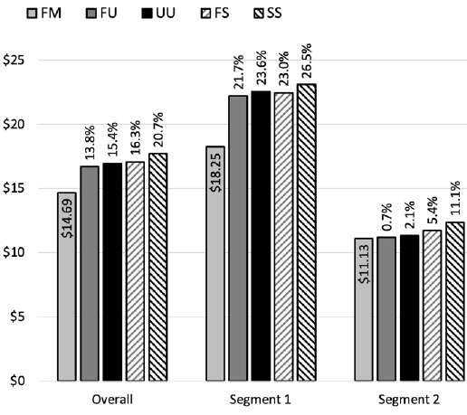

---
# You can also start simply with 'default'
theme: Seriph
# random image from a curated Unsplash collection by Anthony
# like them? see https://unsplash.com/collections/94734566/slidev
background: ./assets/cover_bg.webp
# some information about your slides (markdown enabled)
title: ارائه درس شبیه سازی
info: |
  ## Slidev Starter Template
  Presentation slides for developers.

  Learn more at [Sli.dev](https://sli.dev)
# apply unocss classes to the current slide
class: text-center
# https://sli.dev/features/drawing
drawings:
  persist: false
# slide transition: https://sli.dev/guide/animations.html#slide-transitions
transition: slide-left
# enable MDC Syntax: https://sli.dev/features/mdc
mdc: true
dir: rtl
addons:
  - slidev-addon-rabbit
  - fancy-arrow

rabbit:
  slideNum: true
---

# Markov Chains & Dynamic Pricing
## Airline Ancillary Offer Optimization

<!--
ancillary: خذمات جانبی
-->

امیر حسین دشتی و علیرضا قبادی، ۱۴۰۴/۰۱/۱۹

<carbon:arrow-right />  اسلاید بعدی 

<!--
The last comment block of each slide will be treated as slide notes. It will be visible and editable in Presenter Mode along with the slide. [Read more in the docs](https://sli.dev/guide/syntax.html#notes)
-->
---
dir: rtl
transition: fade-out
---

# موضوعات مورد بحث
کامل شود با فرمت لیست

---
layout: section
---

# تعاریف اولیه

در این بخش به ارائه اصطلاحات  مورد استفاده در ارائه خواهیم پرداخت.

---
dir: rtl
---

# تعاریف اولیه

## Offer
منظور از offer یک پیشنهاد برای خرید است که احتمالا با قیمت ارزان‌تر از قیمت مورد انتظار خواهد بود. یک پیشنهاد می‌تواند به صورت bundle(ترکیبی از چند محصول) یا تکی باشد.

---
layout: section
dir: rtl
---

# مقدمه

در این بخش شروع به توضیح مسئله و تشریح آن می‌پردازیم.

---
transition: fade-out
dir: rtl
src: ./pages/introduction.rtl.md
---

some text

---
layout: fact
dir: rtl
transition: slide-down
---

<strong>
احتمال خرید یک پیشنهاد، فقط به قیمت اون پیشنهاد وابسته نیست. بلکه به قیمت سایر پیشنهادات در سبد پیشنهادات برای مشتری نیز بستگی دارد
</strong>

<FancyArrow v-click="2" q1="[data-id=customers-rights]" pos1="bottom" q2="[data-id=customers-wrongs]" head-size="30" pos2="top" color="teal" width="4" roughness="3" arc="0.1" seed="1" />

 
 
 

مشتری 

زمانی که یک آفر دریافت می‌کنه اون رو با جایگزین‌های موجود مقایسه می‌کنه

---
layout: section
dir: rtl
---

# توضیح کسب درآمد صنعت هواپیمایی

در زمان گذشته، حال، آینده

---
layout: section
dir: rtl
---

## گذشته و حال

---
dir: rtl
transition: fade
---
از سال ۲۰۰۰ به بعد، دو مدل اصلی در فروش بلیط هواپیما ظهور کرد:

## خطوط هوایی کامل (Full-Service Airlines)
  - فروش بلیط به صورت بسته‌بندی شده (باندل)
  - خدمات جنبی مانند بار مجانی، غذا و انتخاب صندلی به‌صورت پیش‌فرض در قیمت بلیط گنجانده می‌شد.
  - مدل درآمدی مبتنی بر قیمت ثابت و خدمات یکپارچه.

## خطوط هوایی کم‌هزینه (Low-Cost Carriers - LCCs)
- فروش بلیط پایه به صورت جدا از خدمات اضافی
- خدمات جانبی (اضافه‌بار، غذا، صندلی) به صورت اختیاری و با هزینه جداگانه ارائه می‌شد.
- حق انتخاب بیشتر برای مسافر و مدل درآمدی انعطاف‌پذیر.

---
dir: rtl
transition: fade
---

## همگرایی دو مدل کسب‌وکار
با گذشت زمان، هر دو گروه به سمت یکدیگر حرکت کردند:

- شرکت‌های کم‌هزینه با مشاهده موفقیت مدل باندل، شروع به ارائه پکیج‌های ترکیبی کردند تا مشتریان خطوط سنتی را جذب کنند.
- خطوط هوایی سنتی برای رقابت با شرکت‌های ارزان‌قیمت، فروش تک‌خدمات (Unbundled) را آغاز کردند تا به مسافران انعطاف بیشتری بدهند.
- امروز، مرز بین این دو مدل کمرنگ شده و بسیاری از شرکت‌ها ترکیبی از هر دو استراتژی را به کار می‌گیرند تا پاسخگوی نیازهای متنوع مسافران باشند.

---
layout: section
dir: rtl
---

## ایده برای آینده

 شرکت‌های هواپیمایی برای تحقق هدف ایجاد پیشنهادهای پویا، می‌خواهند مجموعه‌ای از پیشنهادات را ارائه دهند که متناسب با درخواست مشتری و شرایط سفر، هم از نظر محتوا و هم از نظر قیمت، سازگار بوده و در تمام کانال‌های دریافت پیشنهاد یکسان باشد.

---
dir: rtl
layout: two-cols
class: text-center
---

<template v-slot:default>

# توضیع فعلی محصولات

</template>
<template v-slot:right>

# ویژگی‌ها

<v-clicks>

- مشتریان با مجموعه‌ای از  صفحات فروش ثابت  مواجه می‌شوند.
- پیشنهادهای ارائه شده (محصولات و قیمت‌ها) برای همه مشتریان یکسان هستند.
- پیشنهادها بر اساس نیازها یا سابقه خرید مشتریان شخصی‌سازی نمی‌شوند.
- این روش فرصت ارائه پیشنهادهای مکمل و افزایش فروش را از دست می‌دهد.

</v-clicks>

</template>

---
dir: rtl
layout: two-cols
class: text-center
---

<template v-slot:default>

# پیشنهادات پویا

</template>
<template v-slot:right>

# ویژگی‌ها

 
 

- قیمت‌ها و پیشنهادات بسته به زمینه سفر (مانند تفریحی در مقابل تجاری) تغییر می‌کنند.

</template>

---
dir: rtl
layout: image
---

# ساخت و قیمت گذاری آفر در یک نگاه

---
layout: section
dir: rtl
---

# فرمول‌سازی مسئله

یک پیشنهاد ۲ بخش دارد مجمو‌عه‌ای ناتهی از محصولات و یک قیمت .

---
dir: rtl
---

# یک پیشنهاد چیست
 

فرض کنید یک ایرلاین 
$k$ 
محصول اتومیک دارد.

$$A = \{1,2, \cdots , k\}$$

$$a=1,\dots ,K$$

$$O\subseteq \mathcal{A}$$

$$\Omega =\mathrm{P}\left(\mathcal{A}\right)\backslash \left\{ \emptyset \right\}$$

$$\left|\Omega \right|={2}^{K}-1$$

---
dir: rtl
---

# مجموعه پیشنهاد قیمت گذاری نشده چیست

 

$$S=\left\{ {O}_{1},\dots ,{O}_{N}\right\}$$

$$S\subseteq\Omega$$

$$1\le N\le |\Omega |$$

$$\mathrm{P}\left(\Omega \right)\backslash \left\{ \emptyset \right\}$$

$${O}_{0}=\emptyset$$

$$S\cup \left\{ {O}_{0}\right\}=\left\{ {O}_{0},{O}_{1},\dots ,{O}_{N}\right\}$$

---
dir: rtl
---

# مجموعه پیشنهاد قسمت گذاری شده

 

فرض کنید $S$ یک مجموعه پیشنهاد قیمت گذاری نشده باشد.

$$ {\mathbf{p}}\left(S\right)=\left({p}_{1}(S),\dots ,{p}_{N}(S) \right) $$

$${p}_{i}\left(S\right)={p}_{i}={ {p}_{O_{i}}}$$

$${p}_{0}(S)=0$$

---
dir: rtl
---

# یک مثال

$$K=3$$

$$\mathcal{A}=\left\{\mathrm{1,2},3\right\}$$

$$\Omega =\mathrm{P}\left(\mathcal{A}\right)\backslash \left\{ \emptyset \right\}$$

$$\left|\Omega \right|=7$$

$$\Omega =\left\{ {O}_{1},{O}_{2},{O}_{3},{O}_{4},{O}_{5},{O}_{6},{O}_{7}\right\}=\left\{\left\{1\right\}, \left\{2\right\}, \left\{3\right\},\left\{\mathrm{1,2}\right\},\left\{\mathrm{1,3}\right\}, \left\{\mathrm{2,3}\right\}, \left\{\mathrm{1,2},3\right\}\right\}$$

$${S}_{1}=\left\{\left\{1\right\}, \left\{2\right\}, \left\{\mathrm{1,2},3\right\}\right\}$$

$${S}_{2}= \left\{\left\{1\right\}, \left\{3\right\},\left\{\mathrm{1,2},3\right\}\right\}$$

$$S=\Omega \text{ , S isfull offer set}$$

---
dir: rtl
---

# تعریف تابع هدف بهینه سازی

 

### یک فرض مهم
فرض می‌کنیم مشتری فقط یک پیشنهاد را برای خرید انتخاب می‌کند

$$\left\{\left\{1\right\},\left\{2\right\}\right\} \implies \left\{\left\{1\right\},\left\{2\right\},\{\mathrm{1,2}\}\right\}$$

### مدل انتخاب گسسته

$$\mathcal{P}\left({O}_{i}|S,{\mathbf{p}}\left(S\right)\right)$$

این تابع مشخص کننده احتمال خرید محصول 

${O}_{i}$

در بین 

$S=\left\{ {O}_{1},\dots ,{O}_{N}\right\}$

### تابع هدف درامد مورد انتظار

$$\begin{array}{c}\pi \left(S, {\mathbf{p}}\left(S\right)\right)=\sum\limits_{i=1}^{N}\left({p}_{i}-{c}_{i}\right)\mathcal{P}\left({O}_{i}|S, {\mathbf{p}}\left(S\right)\right)\end{array}$$

---
dir: rtl
---

# مقدار تابع احتمال خرید پیشنهاد

 

احتمال خرید یک پیشنهاد از مجموع پیشنهادات برابر تعداد دفعاتی است که آن محصول دیده‌می‌شود.

$$\mathcal{P}(O_i|S, \bm{p}(S)) = v_i(\bm{p}(S)) \theta_i(p_i)$$

 

که با توجه به پارامتر‌های تایین می‌توان مقدار $v_i$ را تعیین نمود.

$$v_i(\bm{p}(S)) = \lambda_i + \sum_{j=1,\dots,N} \rho_{ji} (1 - \theta_j(p_j)) v_j(\bm{p}(S))$$

---
dir: rtl
---

# بهینه سازی روی تابع هدف

 

$$\begin{array}{c}\pi \left(S, {\mathbf{p}}\left(S\right)\right)=\sum\limits_{i=1}^{N}\left({p}_{i}-{c}_{i}\right)\mathcal{P}\left({O}_{i}|S, {\mathbf{p}}\left(S\right)\right)\end{array}$$

### بهینه سازی این تابع به ۲ عامل بستگی دارد:
 

#### قیمت اعلام شده برای پیشنهاد
ورودی: $S$ یک مجموعه بدون قیمت است.

$${ {\mathbf{p} } }^{\boldsymbol{*} }\left(S\right)={\mathrm{argmax} }_{ {\mathbf{p} } }\pi \left(S,{\mathbf{p} }\left(S\right)\right)$$

#### انتخاب مجموعه پیشنهادها
ورودی:  ${\mathbf{p}}\left(S\right)$, $S\subseteq\Omega$ 

$$S^*={\mathrm{argmax} }_{S\subseteq \Omega }\pi \left(S,{\mathbf{p} }\left(S\right)\right)$$

---
dir: rtl
layout: fact
---

مسئله‌ قیمت‌گذاری و انتخاب مجموعه پیشنهادها به صورت ترکیبی، پیچیدگی جدیدی ایجاد نمی‌کند و این ۲ مسئله را به صورت جست و جوی جامع حل می‌کنیم. به عبارت دیگر برای همه مجموعه پیشنها‌های ممکن به دنبال قیمت بهینه می‌گردیم و مواردی را انتخاب می‌کنیم که بهتر سود را داشته باشد.

---
dir: rtl
---

# ویژگی‌های مهم

- ویژگی‌های مدل انتخاب گسسته  $\mathcal{P}\left({O}_{i}|S, {\mathbf{p}}\left(S\right)\right)$ 

  - **مقیاس‌پذیر:**  
    احتمالات خرید حتی برای مجموعه‌های پیشنهادی بزرگ نیز قابل محاسبه هستند.

  - **قابل سفارشی‌سازی:**  
    مجموعه پیشنهادها را می‌توان متناسب با هر مشتری تنظیم کرد.

  - **قابل تفسیر:**  
    یک مدل پارامتری انتخاب گسسته که امکان تفسیر نتایج را فراهم می‌کند.

  - **قابل برآورد:**  
    پارامترهای مدل را می‌توان از داده‌های آموزشی تخمین زد.

  - **قابل مدیریت:**  
    حتی برای مجموعه‌های پیشنهادی بزرگ، می‌توان قیمت‌های بهینه برای حداکثر سود یا بهترین مجموعه پیشنهادی را به راحتی تعیین کرد.

---
dir: rtl
---

# ویژگی‌های مهم

- قیمت منطقی

$$S = \left\{\left\{1\right\},\left\{2\right\},\{\mathrm{1,2}\}\right\}$$

$$\mathrm{max}({p}_{\left\{1\right\}},{p}_{\left\{2\right\}}) \le {p}_{\left\{\mathrm{1,2}\right\}} \le {p}_{\left\{1\right\}}+{p}_{\left\{2\right\}}$$

---
layout: section
dir: rtl
---

# چگونگی عملکرد MCCM

مزیت MCCM: احتمال خرید باندل‌های غیر سودآور را ضعیف کرده و مشتریان را به خرید پیشنهادات سودآور هدایت می‌کند.

---
dir: rtl
---

# شیوه عملکرد زنجیر‌های مارکوفی

---
dir: rtl
---

# بهینه‌کردن قیمت
به کمک فراید تصمیم گیری مارکوفی

## مفاهیم مورد نیاز

 

تعریف فرمال یک مسئله بهینه سازی

$$\left(\mathcal{S},\mathcal{A},\mathcal{R},\mathcal{P}\right)$$

- مجموعه حالات ممکن  $\mathcal{S}=S\cup \{ {O}_{0},T\}$, $S=\left\{ {O}_{1},\dots ,{O}_{N}\right\}\subseteq\Omega$  
- مجموعه قیمت‌های ممکن  $\mathcal{A}={\mathbb{R} }_{+}$ 
-  درامد حاصل  $\mathcal{R}(O_i,p_i,s') = (p_i-c_i)\cdot\mathbb{I}_{s'=T}$ 
- احتمال رفتن از s به 's
     $\mathcal{P}(O_i, p_i, s') = 
\begin{cases} 
\theta_i(p_i) & \text{if } s' = T \\
(1 - \theta_i(p_i)) \rho_{ij} & \text{if } s' = O_j \\
(1 - \theta_i(p_i))(1 - \sum_{j>0} \rho_{ij}) & \text{if } s' = O_0 
\end{cases}$  
---
dir: rtl
---

# بهینه‌کردن قیمت
به کمک فراید تصمیم گیری مارکوفی

## تابع هدف بهینه سازی

$$V^*(s) = \max_{\bm{p}} \sum_{s' \in \mathcal{S}} \mathcal{P}(s, \bm{p}, s') \big[ \mathcal{R}(s, \bm{p}, s') + V^*(s') \big]$$

که $V^*(s)$ نشان دهنده درامد بهینه است.

 

که این تابع دارای شرایط تابع بلمن است که به صورت زیر حل می‌شود.

$$V_{k+1}(s) = \max_{\bm{p}} \sum_{s' \in \mathcal{S}} \mathcal{P}(s, \bm{p}, s') \left[ \mathcal{R}(s, \bm{p}, s') + V_k(s') \right]$$

با توجه به داشتن شرایط تابع بلمن این تابع با هر حدس اولیه‌ای همگرا خواهد بود. (مبلغ آغازین مهم نیست)

---
dir: ltr
layout: fact
---

$$\bm{p}^*(s) = \arg\max_{\bm{p}} V^*(s)$$

---
dir: rtl
---

# افراز مشتریان

برای اینکه بتوانیم با توجه به موضوع سفر پیشنهادات مناسب ارايه دهیم مشتریان را به l دسته افراز می‌کنیم.

$$\theta_{i,l}(p) = \left( \prod_{a \in O_i} \phi_{a,l} \right) \left( 1 - \Phi \left( \frac{p_i - \mu_{O_i,l}}{\sigma_{O_i,l}} \right) \right)$$

$$\theta_{i}(p_i) = \sum_{l=1}^{L} w_l \theta_{i,l}(p_i)$$

- که در آن Φ(𝑥) تابع توزیع تجمعی (CDF) متغیر نرمال استاندارد 𝑁(0,1) است.
- $\phi_{a,l}$ نشان دهده ارتباط خدمات جانبی $i$ به افراز $l$ام است.

---
layout: center
---

# Results and Performance

we implement a simple model in a hypothetical market wit 2 customer segments to test if our model reaches our desirable result

---
layout: section
---

# Sections

- Setup
- Scenarios
- Baseline pricing 
- Full offerset selection, Unsegmented pricing
- Sensitivity analysis
- Unsegmented offerset selection, Unsegmented pricing
- Full/Segmented offerset selction, Segmented pricing
- Performance comparison

---
layout: default
---

# Setup
setting assumptions for our experiment

- Airline offers 3 ancillary sevices $\mathcal{A} = \{1,2,3\}$ which are in order bag, seat, and meal
- Customers are equally divided into two segments
  - Leisure travelers
  - Bussiness travelers
- We assume the default parameters are as the ones shown in the next table
- Arrival and transition probabilities are uniform

---
layout: center
---

---
layout: default
---

# Scenarios
what our models look like

**Offer set selection**
- no offer set selection
- unsegmented offer set selection
- segmented offer set selection

**Offer set pricing**
- myopic la carte pricing
- unsegmented pricing
- segmented pricing

---
layout: default
---

# Baseline pricing (myopic)
our base model

3 key assumptions:
- the airline knows the true customer valuation distribution for each ancillary service
- the price for each ancillary is optimized myopically without considering other offers in the offerset
- no bundle discount
the formula for the optimal price for each ancillary service is
$p_a^* = \operatorname{Argmax}_{p_a} \left( 1 - \Phi \left( \frac{p_a - \mu_a}{\sigma_a} \right) \right) (p_a - c_a)$
and the price of each bundle is the sum of included ancillary services' prices $p(0) = \sum_{a \in 0} p_a^*$

Myopic gives a baseline pricing for ailines considering some limitatians they can face

{style="scale: 0.7;"}

---
layout: default
---

# Full offerset selection, Unsegmented pricing
basic MCCM implemetation

we now implement our MCCM and here the segments are again only diffrent in relevancy
we can observe that the prices are higher on MCCM compared to myopic specially in single ancillary offers in order to insentivise customers to buy bundles at a discount. even tho the total ancillary purchase rate decreases in our model but the expected revenue per customer increases

{style="scale: 0.8;"}

---
layout: default
---

# Sensitivity analysis
testing how sensitive MCCM is to input parameters

in the table provided in next page we'll see how our result changes based on shifting 3 parameters one at a time each time
- **Cost of provision**: we increase the cost of all 3 ancillaries equally from 0 to 30. the prices increase non linearly in both models and the probability of purchase drops. under more ideal conditions MCCM outperforms myopic by a good margin but under less ideal conditions they have similar results
- **Relevance**: relevance shifts from 10 to 100. since bundle relevance is sirect product of ancillary relevances low relevance means bundles are less attractive but high relevance makes bundles highly attractive
- **Transition probability**: transition probabilty shifts from 0 to 16 percent, so the transition from any offer to no purchase decreases from 100 to 4. as probabilty of no purchase decreases the MCCM becomes alot more profitable
as we can see not only is MCCM scalable and customizable but also bundle prices remain logical and robust

---
layout: center
---

# Sensitivity graphs
sensitivity testing results

{style="scale: 0.8;"}

---
layout: default
---

# Unsegmented offerset selection, Unsegmented pricing
optimal offerset selection for unsegmented pricing

we systematicaly evaluate all 127 possible $S \subset \Omega$ for each set size |S| we find the S* = $\operatorname{argmax}_S \pi(S, p(S))$, the corresponding price p(s) and the expected purchase rates $\mathcal{P}(S)$ by customer segment.
as we can see the optimal price of an offer changes depending on the offerset unlike myopic this is because MCCM takes into account the risk of no purchase and the potential buy up to a more profitable bundle. we can also see that removing unattractive offers reduces the risk of no purchase
Another thing that we can take into account is the device the customer is using for example a mobile screen may only be able to show up to 3 offers so we have to limit ourselves to |S| $\leq$ 3 

---
layout: center
---

# UU Results
all offerset selection results

{style="scale: 0.8;"}

---
layout: default
---

# Full/Segmented offerset selction, Segmented pricing

for this scenarios we run 2 seperate MCCM models one for each segment

{style="scale: 0.8;"}

---
layout: default
---

# Performance comparison

as we look at the comparison of diffrent scenarios we can see that our model does infact offer an increase to the overall $\pi$*

{style="scale: 0.8;"}
---
transition: fade
---

<h1 dir="rtl">
منابع
</h1>

- Dynamic offer creation for airline ancillaries using a Markov chain choice model, Kevin K. Wang, 2023

---
layout: end
---
با تشکر از همراهی شما
